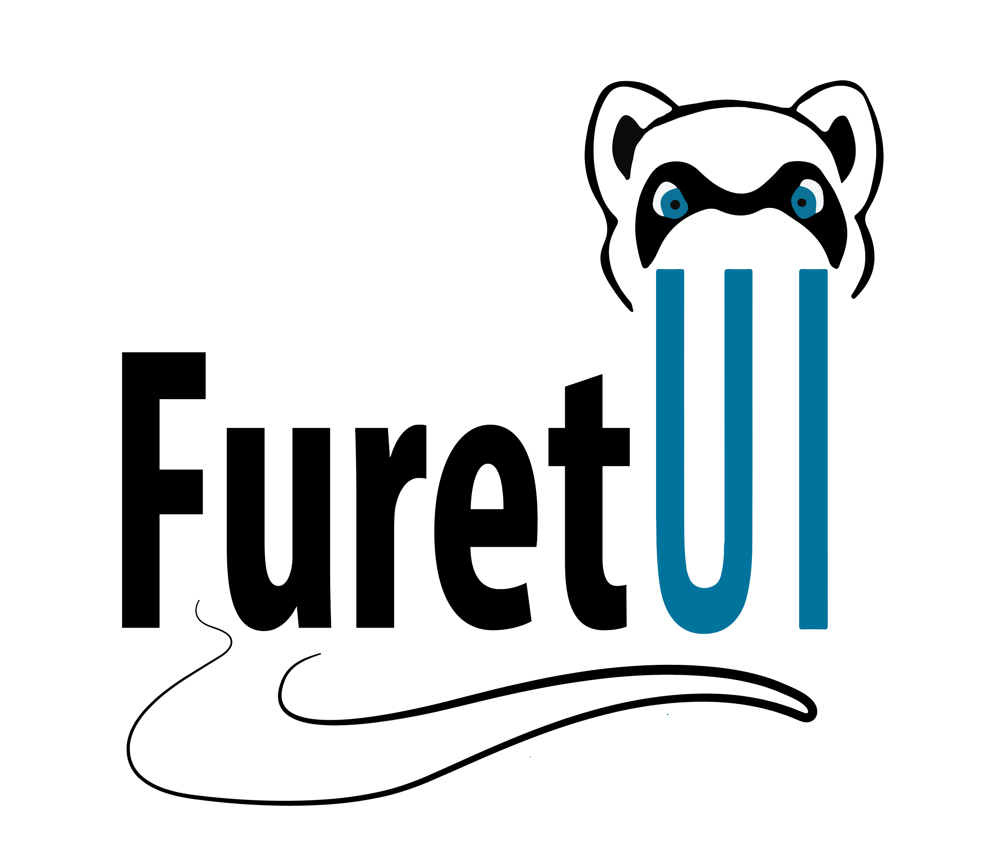

.. This file is a part of the AnyBlok project
..
..    Copyright (C) 2017 Jean-Sebastien SUZANNE <jssuzanne@anybox.fr>
..
.. This Source Code Form is subject to the terms of the Mozilla Public License,
.. v. 2.0. If a copy of the MPL was not distributed with this file,You can
.. obtain one at http://mozilla.org/MPL/2.0/.

.. image:: https://travis-ci.org/AnyBlok/anyblok_furetui.svg?branch=master
    :target: https://travis-ci.org/AnyBlok/anyblok_furetui
    :alt: Build status

.. image:: https://coveralls.io/repos/github/AnyBlok/anyblok_furetui/badge.svg?branch=master
    :target: https://coveralls.io/github/AnyBlok/anyblok_furetui?branch=master
    :alt: Coverage

.. image:: https://img.shields.io/pypi/v/anyblok_furetui.svg
   :target: https://pypi.python.org/pypi/anyblok_furetui/
   :alt: Version status
   
.. image:: https://readthedocs.org/projects/anyblok_furetui/badge/?version=latest
    :alt: Documentation Status
    :scale: 100%
    :target: https://doc.anyblok.org/en/latest/?badge=latest

AnyBlok FuretUI
===============

|furetui|

FuretUI is a web client for AnyBlok.

AnyBlok FuretUI is the glue between AnyBlok and FuretUI that expose your model
as CRUD, implement required furetui HTTP interfaces which helps developer
to make suite user interfaces to AnyBlok projects.

anyblok_furetui is released under the terms of the `Mozilla Public License`.

See the `latest documentation <http://furetui.anyblok.org/>`_

